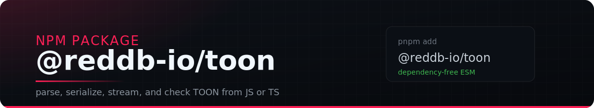
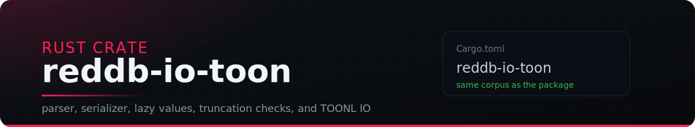
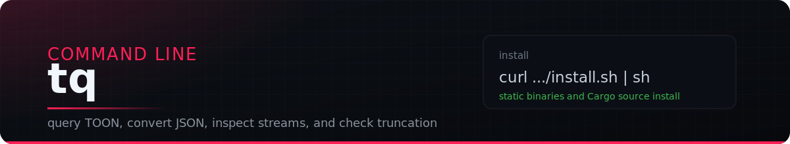

<div align="center">


[](https://github.com/reddb-io/toon/releases)
[](https://github.com/reddb-io/toon/actions/workflows/ci.yml)
[](LICENSE)
[](#prebuilt-binaries)

</div>

---

## Attribution

This is not the original TOON project. The TOON format was created by [Johann Schopplich](https://github.com/johannschopplich) — if you want to learn about or use TOON itself, follow the official repository at [github.com/toon-format/toon](https://github.com/toon-format/toon) and the official docs at [toonformat.dev](https://toonformat.dev).

This repository is the toolset that [RedDB](https://reddb.io) built on top of TOON for day-to-day use: a TypeScript library (`@reddb-io/toon`), a Rust crate, the `tq` CLI, the TOONL streaming extension, and opt-in RedDB extensions. Full credit goes to Johann and the toon-format team for the original format and spec.

---

## Formats

TOON is a token-oriented object notation for carrying structured JSON-shaped data through prompts and pipelines with less syntax overhead. It keeps the JSON data model, adds length-bearing tabular forms, and makes common truncation failures visible to decoders.

TOONL is the append-only stream form: one record per line, header once, and optional trailers for closed-stream verification. It is the streaming layer used by the JS package, Rust crate, and `tq`.

The root README is a hub, not the normative spec. Use these documents for detail:

- [Official TOON companion](docs/toon-official-spec.md): the upstream TOON behavior this repository tracks.
- [RedDB TOON extensions](docs/toon-reddb-spec.md): opt-in dialect features implemented here.
- [TOONL RedDB spec](docs/toonl-reddb-spec.md): append-only stream grammar and reader/writer behavior.
- [Dialect proposals](docs/proposals/): how this repository's dialect differs from the original TOON project and why each extension exists.

---

## What ships



### `@reddb-io/toon` — JS/TS package

Dependency-free ESM for parsing, serializing, truncation checks, and TOONL stream helpers in JavaScript, TypeScript, Node, Bun, Deno, and browsers.

```bash
pnpm add @reddb-io/toon
```

```js
import { parse, serialize } from '@reddb-io/toon'

const document = parse('users[2]{id,name}:\n  1,Ada\n  2,Linus\n')
console.log(document.users[0].name)
process.stdout.write(serialize(document))
```
```console
Ada
users[2]{id,name}:
  1,Ada
  2,Linus
```

```js
import { encodeRecords, parseRecords } from '@reddb-io/toon'

const stream = encodeRecords([
  { id: 1, name: 'Ada' },
  { id: 2, name: 'Linus' },
])

process.stdout.write(stream)
console.log(JSON.stringify(parseRecords(stream)))
```
```console
[]{id,name}:
1,Ada
2,Linus
[=2]
[{"id":1,"name":"Ada"},{"id":2,"name":"Linus"}]
```

Details: [`packages/toon`](packages/toon), [TOON spec companion](docs/toon-official-spec.md), [RedDB TOON extensions](docs/toon-reddb-spec.md), and [TOONL spec](docs/toonl-reddb-spec.md).



### `reddb-io-toon` — Rust crate

The parser, serializer, lazy document model, truncation detector, and TOONL reader/writer used by the CLI.

```toml
[dependencies]
reddb-io-toon = "0.1"
```

```rust
use reddb_io_toon::Value;

fn main() -> Result<(), Box<dyn std::error::Error>> {
    let document = Value::parse_toon("users[2]{id,name}:\n  1,Ada\n  2,Linus\n")?;
    println!("{}", document.to_canonical_toon());
    Ok(())
}
```

Details: [`crates/toon`](crates/toon), [decoder and encoder options](docs/toon-official-spec.md), [RedDB extension rules](docs/toon-reddb-spec.md), and [streaming format](docs/toonl-reddb-spec.md).



### `tq` — CLI

A jq-style command-line tool for querying TOON, converting between TOON, TOONL, and JSON, checking truncated input, and working with append-only streams.

```bash
curl -fsSL https://raw.githubusercontent.com/reddb-io/toon/main/install.sh | sh
```

```bash
printf 'users[2]{id,name}:\n  1,Ada\n  2,Linus\n' \
  | tq '.users[].name'
```

Source install:

```bash
cargo install reddb-io-tq
```

Details: [`crates/tq`](crates/tq), [release assets](https://github.com/reddb-io/toon/releases), and [development commands](#develop).

---

## Navigation

| Need | Go to |
| --- | --- |
| Performance methodology and reports | [`benchmarks/`](benchmarks/) |
| TOON format detail | [`docs/toon-official-spec.md`](docs/toon-official-spec.md) and [`docs/toon-reddb-spec.md`](docs/toon-reddb-spec.md) |
| TOONL stream detail | [`docs/toonl-reddb-spec.md`](docs/toonl-reddb-spec.md) |
| RedDB dialect proposals | [`docs/proposals/`](docs/proposals/) |
| JavaScript and TypeScript package | [`packages/toon`](packages/toon) |
| Rust format crate | [`crates/toon`](crates/toon) |
| CLI crate and binary | [`crates/tq`](crates/tq) |
| Releases and binary downloads | [GitHub releases](https://github.com/reddb-io/toon/releases) |

---

## Prebuilt binaries

Each release publishes `tq` binaries for Linux, macOS, and Windows, plus checksums and build provenance. The installer script resolves the matching asset for the current platform and installs or updates `tq` in place.

```bash
curl -fsSL https://raw.githubusercontent.com/reddb-io/toon/main/install.sh | sh
```

Useful installer knobs:

| Variable | Effect |
| --- | --- |
| `TQ_VERSION` | Pin a release tag |
| `TQ_CHANNEL` | Use `stable` or `next` |
| `TQ_INSTALL_DIR` | Choose the installation directory |
| `TQ_FORCE` | Reinstall even when already current |

---

## Develop

```bash
git clone https://github.com/reddb-io/toon
cd toon
git submodule update --init

cargo test --workspace
cargo run -p reddb-io-tq -- . deploys.toon

corepack enable
pnpm install
pnpm -r test
```

The Rust workspace contains `crates/toon` (`reddb-io-toon`) and `crates/tq` (`reddb-io-tq`). The pnpm workspace contains `packages/toon` (`@reddb-io/toon`). Release automation keeps all three on the same version.

## License

[MIT](LICENSE).
