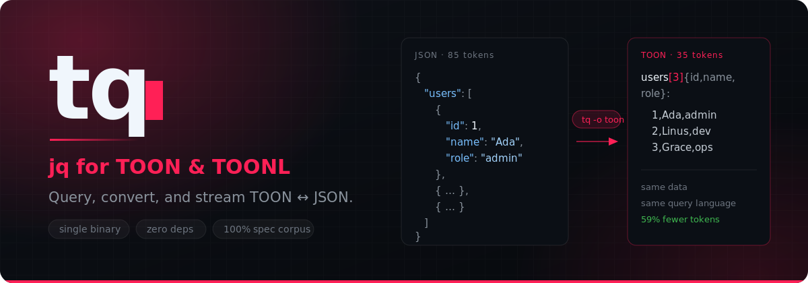

<div align="center">



[](https://github.com/reddb-io/toon/releases)
[](https://github.com/reddb-io/toon/actions/workflows/ci.yml)
[](LICENSE)
[](#prebuilt-binaries)

</div>

---

## What this repo ships

This is the monorepo for the **TOON** format: two format specs, and three implementations that speak them. Each surface below has its own section.

| Surface | Deliverable | Install |
| --- | --- | --- |
| **Format** | [TOON v3.3](#toon) — the token-oriented object notation, at 100% of the [official spec](https://github.com/toon-format/spec) corpus ([annotated companion](docs/toon-spec.md)), plus two opt-in [reddb-io extensions](docs/toon-spec-reddb-flavored.md) | — |
| **Format** | [TOONL](#toonl--append-only-streams) — our append-only streaming extension ([unified spec](docs/toonl.md); v0.2 is a strict superset of v0.1) | — |
| **CLI** | [`tq`](#tq--the-cli) — jq for TOON: query, convert, stream | `curl -fsSL …/install.sh \| sh` |
| **Rust** | [`reddb-io-toon`](#rust-library) — parser, serializer, lazy document model | `cargo install reddb-io-tq` / crates.io |
| **JS/TS** | [`@reddb-io/toon`](#jsts-library) — the same format, dependency-free ESM | `pnpm add @reddb-io/toon` |

The formats are the product; the CLI and the libraries are how you use them. What holds the three implementations to one behaviour is documented under [Guarantees](#guarantees).

---

## The formats

### TOON

**TOON** (Token-Oriented Object Notation) is a data format designed for one job: putting structured data into an LLM prompt without paying for punctuation. It keeps JSON's data model — objects, arrays, strings, numbers, booleans, null — and drops the syntax tax. Uniform arrays of objects collapse into a header plus rows, so a field name is written once instead of once per record.

#### The same payload, both ways

```json
{
  "service": "checkout",
  "region": "us-east-1",
  "deploys": [
    {
      "id": 1,
      "version": "2.4.0",
      "env": "prod",
      "status": "success",
      "duration": 182
    },
    {
      "id": 2,
      "version": "2.4.1",
      "env": "prod",
      "status": "failed",
      "duration": 47
    },
    {
      "id": 3,
      "version": "2.4.1",
      "env": "staging",
      "status": "success",
      "duration": 164
    },
    {
      "id": 4,
      "version": "2.5.0",
      "env": "prod",
      "status": "success",
      "duration": 203
    }
  ]
}
```

```toon
service: checkout
region: us-east-1
deploys[4]{id,version,env,status,duration}:
  1,2.4.0,prod,success,182
  2,2.4.1,prod,failed,47
  3,2.4.1,staging,success,164
  4,2.5.0,prod,success,203
```

Those two blocks are the same document — the JSON is literally `tq -o json . deploys.toon`. Tokenized with `o200k_base` (the GPT-4o/GPT-5 encoding, via `tiktoken`), they measure:

| Encoding | Tokens | Bytes |
| --- | ---: | ---: |
| JSON, pretty-printed | 200 | 569 |
| JSON, minified | 114 | 353 |
| **TOON** | **91** | **189** |

That is **54% fewer tokens than pretty-printed JSON** and **20% fewer than minified JSON** — on this payload, with this tokenizer. The saving is not a universal constant: it grows with the number of rows in a uniform array (the header is amortized) and shrinks toward zero for deeply nested, non-uniform data, where TOON has nothing to collapse. Measure your own payload before quoting a number; `tq` makes that a one-liner.

TOON is also *self-checking* in a way JSON is not: `[4]` declares the row count and `{id,version,…}` declares the fields, so a truncated or hallucinated table is a parse error rather than silently short data.

#### Beyond the official spec: two opt-in extensions

The official specification is [toon-format/spec](https://github.com/toon-format/spec)
`SPEC.md` v3.3, vendored at `vendor/toon-spec` — the exact pin our conformance
suite runs against, walked through section by section in our
[annotated companion](docs/toon-spec.md). On top of it we implement three extensions, specified
normatively in [`docs/toon-spec-reddb-flavored.md`](docs/toon-spec-reddb-flavored.md) and
originating in upstream RFCs
([spec#46](https://github.com/toon-format/spec/issues/46),
[spec#57](https://github.com/toon-format/spec/issues/57)) and the frozen wire-efficiency grammar. Decoding them is
always on; emitting them is opt-in, so **default output stays byte-identical
canonical v3.3**, and the extension forms are syntax errors for a strict v3 decoder
(fail-closed) rather than silent shape changes.

**Nested tabular headers** let a table column be a uniform nested object,
declared recursively in the header — rows stay flat:

```toon
orders[2]{id,customer{name,country},total}:
  1,Ada,UK,10.5
  2,Bob,US,20
```

**Keyed-map collapse** gives uniform object maps the same treatment, with the
same recursive-brace header grammar:

```toon
people{first,last}:
  joe: Joe,Schmoe
  mary: Mary,Jane
```

This decodes to an object map, not an array. The header is object-typed because
there is no `[N]` segment, so strict v3 decoders reject it instead of silently
reading a different shape. Encoders only emit this form for deterministic
uniform maps: the object has at least two entries, every entry value is a
non-empty object, every entry has the same key set as the first entry, and each
header leaf is primitive. Recursive object leaves are eligible only when nested
tabular headers are also enabled. Non-uniform maps stay in ordinary object form,
as do maps below the entry-count guardrail.

**Primitive-array columns** keep an otherwise tabular object array collapsed when
one or more fields are arrays of primitive scalars:

```toon
items[2]{id,tags[;],quantity}:
  item_0001,hazmat;oversize,60
  item_0002,oversize,11
```

The `tags[;]` header declares `tags` as a primitive-list cell split by `;`.
The row delimiter remains the active table delimiter, and ineligible values such
as null list fields or non-primitive list items fall back losslessly to ordinary
TOON v3.3.
so round-trip is lossless.

### TOONL — append-only streams

**TOONL is to TOON what JSONL is to JSON**: one record per line, header once, append forever — a log you can `>>` into and `tail -f` out of. It is a reddb-io extension — current normative spec: [TOONL](docs/toonl.md) (a single unified document; v0.2 is a strict superset of v0.1) that adds resumable readers, header-preserving trim (`tq trim`), tagged-row multiplexing, and a blessed retry pattern, all implemented in the crate, the package, and `tq` — with a guaranteed bridge back to standard TOON: every *closed* stream converts to a valid TOON v3.3 document in one O(n) pass.

```toonl
[]{ts,level,msg}:
2026-07-14T03:00:00Z,info,boot
2026-07-14T03:00:02Z,error,"disk full"
[=2]
```

The `[]{…}:` header opens a segment, each line is one row, and the optional `[=N]` trailer makes a finished stream verifiable — an open stream is simply a stream that hasn't ended yet. A new header mid-stream rotates the schema.

`tq` processes TOONL **record by record in constant memory** — each row becomes one input, jq-style, and stdin never has to end:

```console
$ tail -f app.toonl | tq -p toonl -o json -c 'select(.level == "error") | .msg'
"disk full"
```

Aggregations that need the whole stream take an explicit `-s` (slurp), exactly like jq — O(n) memory is your call, never a surprise:

```console
$ tq -p toonl -s -o json -c 'sort_by(.score) | map(.id)' scores.toonl
[1,3,2]
```

And `-o toonl` writes streams: header emitted on the first record, automatic rotation when the shape changes, trailer on clean EOF:

```console
$ printf '{"users":[{"id":1,"name":"Ada"},{"id":2,"name":"Bob"}]}' | tq -p json -o toonl '.users[]'
[]{id,name}:
1,Ada
2,Bob
[=2]
```

Rotation is not a special case on the way in either — a new header mid-stream changes the shape of every record after it, and the output follows immediately:

```console
$ printf '[]{a}:\n1\n[]{a,b}:\n2,3\n' | tq -p toonl -o json -c .
{"a":1}
{"a":2,"b":3}
```

And the trailer is what makes a closed stream self-checking: if the row count does not match `[=N]`, `tq` fails loudly instead of handing you a truncated stream.

```console
$ printf '[]{a}:\n1\n2\n[=9]\n' | tq -p toonl -o json -c .
error: line 4: trailer count mismatch
$ echo $?
1
```

#### Why bother? Tokens.

Same payloads, tokenized with `o200k_base` at 10,000 rows ([full benchmark](.red/researches/token-benchmark-toonl-vs-jsonl.md), reproducible via `scripts/research_token_benchmark.py`):

| Payload class | JSONL tokens | TOONL tokens | Saving |
| --- | ---: | ---: | ---: |
| Analytics export | 535,576 | 305,604 | **−42.9%** |
| Flat log | 552,500 | 360,024 | **−34.8%** |
| Envelope (opaque payload cell) | 990,000 | 906,686 | −8.4% |

The saving grows with stream length (the header amortizes) and open TOONL even beats closed TOON by a point or two — there is no `[N]` to pay.

---

## tq — the CLI

**tq** is the command-line tool for the format: a jq-style query language over TOON, and a lossless bidirectional converter between TOON, TOONL and JSON. One static binary, no runtime, no dependencies.

### Install

#### Installer script (recommended)

Detects your OS and architecture, resolves the latest release, verifies the SHA-256 checksum, and installs — or updates an existing `tq` in place.

```bash
curl -fsSL https://raw.githubusercontent.com/reddb-io/toon/main/install.sh | sh
```

It is idempotent: re-running it when you are already on the latest version is a no-op. Knobs:

| Variable | Effect |
| --- | --- |
| `TQ_VERSION` | Pin a tag, e.g. `TQ_VERSION=v0.1.0` |
| `TQ_CHANNEL` | `stable` (default) or `next` (allows prereleases) |
| `TQ_INSTALL_DIR` | Target directory (default: next to an existing `tq`, else `/usr/local/bin`, else `~/.local/bin`) |
| `TQ_FORCE` | Set to `1` to reinstall even when already up to date |

```bash
# Pin an exact version into a directory you control.
curl -fsSL https://raw.githubusercontent.com/reddb-io/toon/main/install.sh \
  | TQ_VERSION=v0.1.0 TQ_INSTALL_DIR="$HOME/.local/bin" sh
```

#### Cargo

The canonical source install, once the crates are published to crates.io (the release pipeline publishes `reddb-io-toon` then `reddb-io-tq` in lockstep from each `v*.*.*` tag):

```bash
cargo install reddb-io-tq   # installs the `tq` binary
```

Until then, install straight from the repository:

```bash
cargo install --git https://github.com/reddb-io/toon reddb-io-tq
```

#### Prebuilt binaries

Every release publishes seven assets. The `-static` musl builds have zero runtime dependencies and run on any Linux regardless of glibc version — prefer them when in doubt.

| Platform | Asset |
| --- | --- |
| Linux x86_64 (glibc) | `tq-linux-x86_64` |
| Linux x86_64 (static musl) | `tq-linux-x86_64-static` |
| Linux aarch64 (glibc) | `tq-linux-aarch64` |
| Linux aarch64 (static musl) | `tq-linux-aarch64-static` |
| macOS Intel | `tq-macos-x86_64` |
| macOS Apple Silicon | `tq-macos-aarch64` |
| Windows x86_64 | `tq-windows-x86_64.exe` |

#### Verify what you downloaded

Each release ships a `SHA256SUMS` manifest (also as `checksums.txt`) covering every binary, plus a build-provenance attestation signed by GitHub:

```bash
TAG=v0.1.0
curl -fsSLO https://github.com/reddb-io/toon/releases/download/$TAG/tq-linux-x86_64
curl -fsSL  https://github.com/reddb-io/toon/releases/download/$TAG/SHA256SUMS -o SHA256SUMS

grep '  tq-linux-x86_64$' SHA256SUMS | sha256sum -c -
gh attestation verify tq-linux-x86_64 --repo reddb-io/toon
```

### Quickstart

Every command below was run against the built binary; the outputs are pasted verbatim. Save the payload as `deploys.toon`:

```toon
service: checkout
region: us-east-1
deploys[4]{id,version,env,status,duration}:
  1,2.4.0,prod,success,182
  2,2.4.1,prod,failed,47
  3,2.4.1,staging,success,164
  4,2.5.0,prod,success,203
```

#### Identity and fields

```console
$ tq .service deploys.toon
checkout

$ tq 'keys' deploys.toon
[3]: deploys,region,service
```

`tq` reads from a file argument or from stdin:

```console
$ printf 'name: Ada\nrole: admin\n' | tq -o json -c .
{"name":"Ada","role":"admin"}
```

#### Tabular arrays: index, slice, iterate

A tabular array indexes and slices like any array, and a slice stays tabular:

```console
$ tq '.deploys[1]' deploys.toon
id: 2
version: 2.4.1
env: prod
status: failed
duration: 47

$ tq '.deploys[1:3]' deploys.toon
[2]{id,version,env,status,duration}:
  2,2.4.1,prod,failed,47
  3,2.4.1,staging,success,164

$ tq -r '.deploys[].version' deploys.toon
2.4.0
2.4.1
2.4.1
2.5.0
```

#### select and map

```console
$ tq '.deploys[] | select(.status == "failed")' deploys.toon
id: 2
version: 2.4.1
env: prod
status: failed
duration: 47
```

Build new objects with explicit keys. Note what happens on the way out: the result is a uniform array of objects, so TOON output re-tabularizes it automatically.

```console
$ tq '[.deploys[] | select(.status == "success") | {version: .version, duration: .duration}]' deploys.toon
[3]{version,duration}:
  2.4.0,182
  2.4.1,164
  2.5.0,203
```

There is no `and`/`or` yet — chain `select` calls instead:

```console
$ tq -o json -c '[.deploys[] | select(.env == "prod") | select(.status == "failed") | .version]' deploys.toon
["2.4.1"]
```

#### Aggregations

```console
$ tq '.deploys | length' deploys.toon
4

$ tq '.deploys | map(.duration) | add / length' deploys.toon
149

$ tq '.deploys | sort_by(.duration) | map(.version)' deploys.toon
[4]: 2.4.1,2.4.1,2.4.0,2.5.0

$ tq '.deploys | max_by(.duration) | .version' deploys.toon
2.5.0

$ tq -o json -c '.deploys | group_by(.env) | map({env: .[0].env, count: length})' deploys.toon
[{"env":"prod","count":3},{"env":"staging","count":1}]

$ tq '[.deploys[].env] | unique' deploys.toon
[2]: prod,staging
```

#### Strings

```console
$ tq -r '.deploys[0].version | split(".") | join("-")' deploys.toon
2-4-0

$ tq '[.deploys[] | select(.version | test("^2\\.4"))] | length' deploys.toon
3
```

#### Converting

`-p` picks the **p**arse format and `-o` the **o**utput format; both accept `toon` or `json`. `-o` defaults to whatever `-p` is, so converting always means naming the output explicitly.

JSON in, TOON out — the uniform array collapses into a table:

```console
$ printf '{"users":[{"id":1,"name":"Ada","admin":true},{"id":2,"name":"Linus","admin":false}]}' | tq -p json -o toon .
users[2]{id,name,admin}:
  1,Ada,true
  2,Linus,false
```

TOON in, JSON out:

```console
$ tq -o json -c '.deploys[0]' deploys.toon
{"id":1,"version":"2.4.0","env":"prod","status":"success","duration":182}
```

Streaming input and output is [TOONL](#toonl--append-only-streams), and it is the same `-p`/`-o` pair.

### Flags

| Flag | Meaning |
| --- | --- |
| `-p toon\|json\|toonl` | Input format (default: `toon`; a named `*.toonl` file auto-selects `toonl`) |
| `-o toon\|json\|toonl` | Output format (default: same as `-p`) |
| `-s`, `--slurp` | TOONL only: materialize the whole stream as one array (for `sort_by`, `group_by`, …) |
| `-r` | Raw output: emit strings unquoted, without JSON escaping |
| `-c` | Compact JSON output (one line, no spaces) |
| `--delimiter comma\|tab\|pipe` | TOON output: choose the active row/header delimiter (default: `comma`) |
| `--nested-tabular-headers` | TOON output: emit [nested tabular headers](docs/toon-spec-reddb-flavored.md) for uniform nested records |
| `--keyed-map-collapse` | TOON output: emit the [keyed-map collapse](docs/toon-spec-reddb-flavored.md) form for uniform object maps |
| `--primitive-array-columns` | TOON output: emit [primitive-array columns](docs/toon-spec-reddb-flavored.md) for eligible primitive-list table fields |
| `-V`, `--version` | Print the version |

### Check mode

`tq check [-p toon|toonl] [FILE]` prints a structured completeness report and exits non-zero when TOON guardrails prove the input is truncated. The report fields are stable across the CLI, Rust crate, and JS package: `complete`, `kind`, `line`, `declared`, `actual`, and `message`.

```console
$ printf 'users[2]{id,name}:\n  1,Ada\n' | tq check
{
  "complete": false,
  "kind": "array_length_mismatch",
  "line": 2,
  "declared": 2,
  "actual": 1,
  "message": "declared 2 rows but received 1"
}
```

### jq compatibility

`tq` implements a deliberate subset of jq's language — enough for the filtering, reshaping and aggregation that real pipelines do, and honest about the rest. Everything in the left column is implemented and covered by tests, several of which run **jq itself as an oracle** and assert byte-identical output.

**Supported**

| Category | Filters |
| --- | --- |
| Paths | `.`, `.foo`, `.foo.bar`, `.[0]`, `.[1:3]`, `.[]` |
| Composition | `\|` (pipe), `,` (comma), `( … )` |
| Constructors | `[ … ]`, `{ key: expr }` |
| Arithmetic | `+`, `-`, `*`, `/` (and unary `-`) |
| Comparison | `==`, `!=`, `<`, `<=`, `>`, `>=` |
| Literals | numbers, strings, `true`, `false`, `null` |
| Builtins | `add`, `from_entries`, `group_by`, `has`, `join`, `keys`, `length`, `map`, `max_by`, `min_by`, `select`, `sort_by`, `split`, `test`, `to_entries`, `unique` |

**Not supported yet** — each of these is a parse error today, not a silent wrong answer:

| Missing | Notes / workaround |
| --- | --- |
| `and`, `or`, `not` | Chain `select(…) \| select(…)` |
| `//` (alternative) | — |
| `?` (optional), `try`/`catch` | Missing fields already yield `null` rather than erroring |
| `if … then … else … end` | — |
| `..` (recursive descent) | — |
| Negative indices (`.[-1]`) | — |
| `{name}` shorthand | Write `{name: .name}` |
| `.["key"]` bracket access | Write `.key` |
| Variables (`as $x`), `reduce`, `foreach`, `def` | — |
| String interpolation `\(…)` | — |
| Assignment (`=`, `\|=`, `del`) | `tq` is read-only |
| `any`, `all`, `flatten`, `range`, `limit`, `tostring`, `tonumber`, `ascii_downcase`, … | Only the 16 builtins above exist |
| `--arg`, `--slurp`, `--null-input`, multiple files | — |

---

## Rust library

The `reddb-io-toon` crate is the parser, serializer and lazy document model that `tq` is built on; you can use it directly.

```toml
[dependencies]
reddb-io-toon = "0.1"
```

```rust
use reddb_io_toon::Value;

fn main() -> Result<(), Box<dyn std::error::Error>> {
    let document = Value::parse_toon(
        "users[3]{id,name,role}:\n  1,Ada,admin\n  2,Linus,dev\n  3,Grace,ops\n",
    )?;

    // Navigate the lazy document model.
    let users = document
        .as_object()
        .and_then(|object| object.get("users"))
        .and_then(Value::as_array)
        .expect("users is an array");
    println!("{} users", users.len());

    if let Some(Value::Object(first)) = users.get(0) {
        println!("first: {:?}", first.get("name"));
    }

    // Canonical TOON round-trip, and JSON on the way out.
    print!("{}", document.to_canonical_toon());
    println!("{}", document.to_json_string(true)?);
    Ok(())
}
```

Decoding uses `ParseOptions::max_depth` and checked encoding uses
`EncodeOptions::max_depth`; both default to `1000`. Set the field to `0` only
for trusted input to disable the nesting guard. Prefer
`try_to_canonical_toon()` / `try_to_toon_with_options(...)` when encoding
untrusted or user-supplied values so depth failures return an `EncodeError`.
`EncodeOptions::delimiter` selects the active TOON delimiter for array and
tabular headers: `','` by default, or `'|'` / `'\t'` for pipe and tab output.
Set `nested_tabular_headers`, `keyed_map_collapse`, or
`primitive_array_columns` to emit the opt-in reddb-io extension forms.

```console
3 users
first: Some(String("Ada"))
users[3]{id,name,role}:
  1,Ada,admin
  2,Linus,dev
  3,Grace,ops
{"users":[{"id":1,"name":"Ada","role":"admin"},{"id":2,"name":"Linus","role":"dev"},{"id":3,"name":"Grace","role":"ops"}]}
```

`Value::from_json_str` / `Value::from_json_value` come in from the JSON side, `to_canonical_toon` and `to_json_string(compact)` go out, and `Document::parse` / `parse_with_options` give you the object model with the spec's decoder options. `detect_truncation_with_options(input, options)` and `detect_toonl_truncation(input)` expose the same structured report as `tq check` for callers that need a diagnosis instead of a decode exception.

For TOONL, the crate exposes streaming APIs directly: `ToonlReader<R: BufRead>` iterates records in constant memory, `ToonlWriter<W: Write>` writes lazy headers with automatic schema rotation, and the bridge functions `jsonl_to_toonl`, `toonl_to_jsonl`, `close_transform_stream`, and `close_transform_stream_interleaved` wire the common conversions without going through the CLI. The default close transform emits one TOON document per lane; the interleaved form emits one document per maximal row run.

---

## JS/TS library

The same format, in dependency-free ESM. `@reddb-io/toon` decodes to (and encodes from) plain JSON values, ships hand-written types, and runs the **same official spec corpus** as the Rust crate — all 389 fixtures, no exceptions.

```bash
pnpm add @reddb-io/toon
```

```js
import { parse, serialize } from '@reddb-io/toon'

const document = parse('users[3]{id,name,role}:\n  1,Ada,admin\n  2,Linus,dev\n  3,Grace,ops\n')

console.log(`${document.users.length} users`)
console.log(`first: ${document.users[0].name}`)

// Canonical TOON round-trip, and JSON on the way out.
process.stdout.write(serialize(document))
console.log(JSON.stringify(document))
```

```console
3 users
first: Ada
users[3]{id,name,role}:
  1,Ada,admin
  2,Linus,dev
  3,Grace,ops
{"users":[{"id":1,"name":"Ada","role":"admin"},{"id":2,"name":"Linus","role":"dev"},{"id":3,"name":"Grace","role":"ops"}]}
```

`parse(input, options)` takes the spec's decoder options (`indent`, `strict`, `expandPaths`), `parseDocument` insists on an object root, and `serialize` writes the canonical default profile unless options such as `{ delimiter: '|' | '\t' }`, `{ nestedTabularHeaders: true }`, `{ keyedMapCollapse: true }`, or `{ primitiveArrayColumns: true }` opt into flavored output. `detectTruncation(input, { format: 'toon' | 'toonl' })` returns the same structured report as the Rust crate and `tq check`.

TOONL is the streaming half: `encodeLines` emits an append-only stream, `decodeLines` reads it back a record at a time, `closeTransform` turns each lane into length-bearing TOON documents, and `closeTransformInterleaved` preserves multiplexed row-run order for post-mortem rendering. The Web Streams API surface (`ToonlDecodeStream`, `ToonlEncodeStream`, `JsonlToToonl`, `ToonlToJsonl`, and `recordTransform`) is universal across Node, Bun, Deno and browsers; in Node, use `Readable.toWeb()` / `Readable.fromWeb()` when crossing between Node streams and Web streams. The optional `@reddb-io/toon/node` subpath adds `readToonlFile(path)` and `writeToonlFile(path, records)` using only `node:fs` and `node:stream`.

```js
import { JsonlToToonl, ToonlToJsonl, closeTransform, closeTransformInterleaved, decodeLines, encodeLines } from '@reddb-io/toon'

// The header is written lazily with the first record, and a schema change
// rotates the segment automatically.
const emitter = encodeLines()
let stream = ''
stream += emitter.push({ ts: '2026-07-14T03:00:00Z', level: 'info', msg: 'boot' })
stream += emitter.push({ ts: '2026-07-14T03:00:02Z', level: 'error', msg: 'disk full' })
stream += emitter.end()
process.stdout.write(stream)

// Read it back one record at a time — the stream never has to fit in memory.
for await (const record of decodeLines(stream)) {
  console.log(`${record.level}: ${record.msg}`)
}

// Close the stream: each segment becomes one canonical TOON document.
process.stdout.write(closeTransform(stream)[0])

const jsonl = new ReadableStream({
  start(controller) {
    controller.enqueue('{"id":1,"name":"Ada"}\n')
    controller.close()
  }
})
const toonl = jsonl.pipeThrough(JsonlToToonl())
const backToJsonl = toonl.pipeThrough(ToonlToJsonl())
for await (const line of backToJsonl) {
  process.stdout.write(line)
}
```

```console
[]{ts,level,msg}:
"2026-07-14T03:00:00Z",info,boot
"2026-07-14T03:00:02Z",error,disk full
[=2]
info: boot
error: disk full
[2]{ts,level,msg}:
  "2026-07-14T03:00:00Z",info,boot
  "2026-07-14T03:00:02Z",error,disk full
{"id":1,"name":"Ada"}
```

`decodeLines` also accepts an async iterable of chunks, so a socket or a file stream flows straight through it.

---

## Guarantees

What keeps two formats and three implementations honest:

- **100% of the official TOON spec corpus, in two runtimes.** The conformance suite reads the fixtures **live from the [`toon-format/spec`](https://github.com/toon-format/spec) submodule** — 389 cases (236 decode, 153 encode) across 22 fixture files — so the corpus tracks upstream instead of drifting from a vendored copy. The Rust crate and `@reddb-io/toon` run the *same* fixtures, so the JS and Rust implementations cannot disagree about the format.
- **A ratchet, not a wishlist.** `tests/toon/expected-failures.txt` lists fixtures the crate does not yet satisfy, entries may only ever be *removed* — and **it is currently empty**.
- **Decoding is checked for correctness, not just for not-crashing.** A decode case passes only when all three hold: it parses, the decoded value equals the fixture's expected JSON, *and* our own canonical output decodes back to that same value. "It returned `Ok`" is not a pass — silently returning the wrong value is the failure mode that matters.
- **jq as an oracle.** Core filter, aggregation and string tests run the same query through real `jq` and assert `tq` produces identical output, so the subset cannot quietly diverge from the language it imitates.
- **~98% line coverage, gated at 95%.** The current workspace run measures **98.15%** lines; CI fails the build under 95% (`cargo llvm-cov --workspace --fail-under-lines 95`), alongside `cargo fmt --check`, `cargo clippy -D warnings`, and the full test suite.
- **The README runs.** Every JS example above is executed as a test on each CI run ([`packages/toon/test/readme-examples.test.mjs`](packages/toon/test/readme-examples.test.mjs)) and its output compared to the `console` block it advertises, so the docs cannot drift from the API.
- **Releases are verifiable.** Every binary ships in a `SHA256SUMS` manifest with a GitHub-signed build-provenance attestation — see [Verify what you downloaded](#verify-what-you-downloaded).

---

## Release channels

| Channel | Trigger | Version | GitHub release |
| --- | --- | --- | --- |
| **stable** | pushing a `v*.*.*` tag | the tag, e.g. `0.1.0` | normal release; publishes both crates to crates.io and `@reddb-io/toon` to npm, in lockstep |
| **next** | every push to `main` | `<base>-next.<run>`, e.g. `0.1.0-next.42` | prerelease; `@reddb-io/toon` goes out under the `next` npm tag |

Both channels build the same seven-asset matrix with checksums and attestations. The installer follows `stable` by default; opt into the bleeding edge, or pin an exact build, with:

```bash
curl -fsSL https://raw.githubusercontent.com/reddb-io/toon/main/install.sh | TQ_CHANNEL=next sh
curl -fsSL https://raw.githubusercontent.com/reddb-io/toon/main/install.sh | TQ_VERSION=v0.1.0 sh
```

---

## Develop

```bash
git clone https://github.com/reddb-io/toon
cd tq
git submodule update --init          # the official TOON spec corpus

cargo test --workspace               # unit, golden, jq-oracle and conformance tests
cargo run -p reddb-io-tq -- . deploys.toon

cargo fmt --check
cargo clippy --workspace -- -D warnings
cargo llvm-cov --workspace --fail-under-lines 95

corepack enable                      # the JS side; always pnpm, never npm/yarn
pnpm install
pnpm -r test                         # conformance, TOONL and README-example tests
```

The Rust workspace is two crates: `crates/toon` (`reddb-io-toon` — the format) and `crates/tq` (`reddb-io-tq` — the `tq` binary). The pnpm workspace is one package: `packages/toon` (`@reddb-io/toon` — the same format in JS). Both run the same official spec corpus, and `scripts/sync-version.sh` keeps all three at one version.

## License

[MIT](LICENSE).
